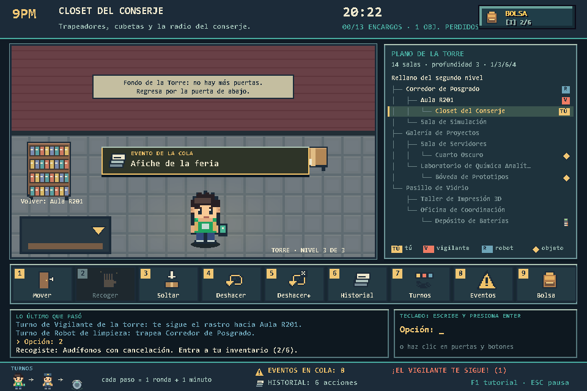
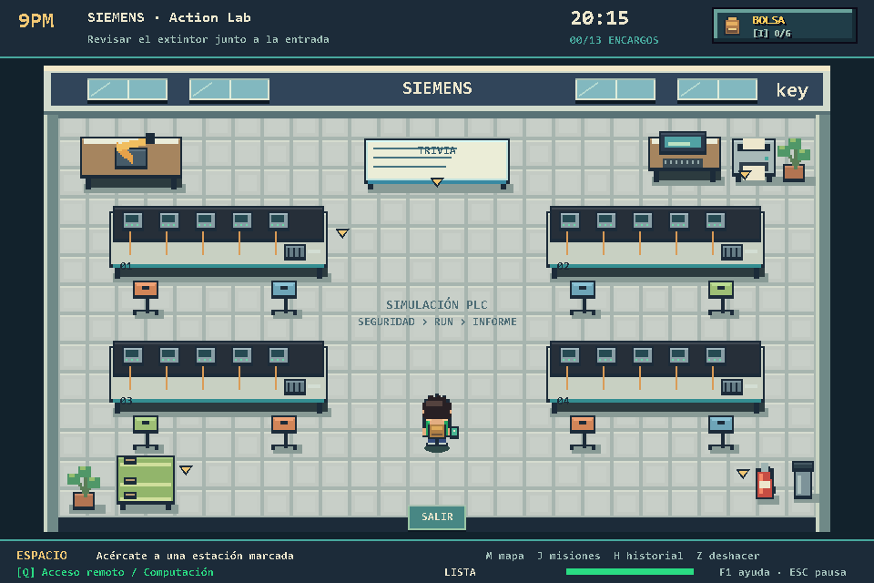

# 9PM

> **Checkpoint 1:** concepto del juego, diagrama de flujo + pseudocódigo y
> evidencia del inventario en [`docs/CHECKPOINT1.md`](docs/CHECKPOINT1.md).
>
> **Checkpoint 2:** historial con pilas, eventos y turnos con colas y la
> Torre de Laboratorios generada con recursividad. La documentación técnica
> está en la sección [Checkpoint 2](#checkpoint-2-historial-eventos-y-mazmorra)
> de este README y la evidencia de ejecución, en
> [`docs/evidencia_checkpoint2.txt`](docs/evidencia_checkpoint2.txt) y
> [`docs/capturas/`](docs/capturas).

Eres un estudiante que se quedó tarde en la universidad. Son las **20:15** y
a las **21:00** empieza el toque de queda: si un vigilante te ve después de
esa hora, te expulsan del campus por esa noche. Completa los 13 encargos de
aulas y laboratorios y sal por el lobby o la terraza antes de que te atrapen.

Es un juego de un solo jugador (no cooperativo), estilo mini RPG/sandbox
visto desde arriba: exploras un mapa fijo (el campus) libremente, recoges
objetos, hablas con NPCs y evitas a un vigilante que patrulla, todo ambientado
de noche.

Desde el Checkpoint 2, las **gradas** del campus ya no dicen "próximamente":
suben a la **Torre de Laboratorios**, un segundo nivel cuyos tabiques móviles
se reacomodan cada noche. Ahí arriba el juego cambia de ritmo: se avanza por
turnos, sala por sala, desde un menú, con un vigilante y un robot de limpieza
que también juegan su turno. En las salas más profundas quedaron objetos
perdidos que valen puntos si sales del campus con ellos.

## Equipo

- José Santiago Merino Herrera
- Frederick William Argueta Tejada
- Nathaly Alessandra Mena Guevara
- Juan Diego Cornejo Gonzalez
- Ricardo Andres Vides Portillo

## Cómo correrlo

```bash
pip install -r requirements.txt
python main.py
```

En Windows, con el entorno local:

```powershell
.\.venv\Scripts\python.exe main.py
```

La partida también se narra en la consola desde la que se abrió el juego
(mazmorra generada, movimientos, eventos, turnos y deshacer).

## Controles

### Campus (nivel 1)

| Tecla | Acción |
|---|---|
| `W A S D` / flechas | Moverse |
| `ESPACIO` | Recoger el objeto cercano, o usarlo en su sala (libro en la biblioteca, USB en el laboratorio) |
| `Q` | Herramienta de tu carrera |
| `M` | Mapa del campus (pausa la partida) |
| `J` | Bitácora de misiones (pausa la partida) |
| `H` | Historial de acciones (pausa la partida) |
| `Z` | Deshacer la última acción del historial |
| `G` | Soltar el último objeto del inventario (queda tirado en el mapa) |
| `I` / `TAB` / clic en **BOLSA** | Abrir y cerrar el inventario (pausa la partida) |
| `F` | Buscar el libro en tu inventario |
| Gradas (debajo de la biblioteca) | Subir a la Torre de Laboratorios |
| `F1` | Repetir el tutorial (campus o Torre, según dónde estés) |
| `F11` | Pantalla completa |
| `ESC` | Pausa / cerrar paneles |

### Torre de Laboratorios (nivel 2)

La Torre se ve como una sala en pixel art: **haz clic en una puerta** del
fondo para cruzarla (la placa dice a qué sala lleva) y en la puerta de abajo
para volver. La barra de iconos tiene las 9 opciones del menú. Con teclado, se
escribe el número de la opción y se confirma con `ENTER`. `ESC` cancela un
submenú o abre la pausa.

```
1 Moverse          2 Recoger objeto    3 Soltar objeto
4 Deshacer última  5 Deshacer varias   6 Ver historial
7 Ver turnos       8 Ver eventos       9 Ver inventario
```

En el submenú **Moverse** también se puede escribir el nombre de la sala (sin
importar mayúsculas ni tildes). Para volver al campus hay que regresar al
rellano y elegir **Bajar por las gradas al campus**.

### Tutorial de bienvenida

La primera partida empieza con un recorrido corto por la interfaz: oscurece
la pantalla, ilumina cada parte (tú, el objetivo, la hora, la bolsa, el
minimapa, las gradas…) y la explica con una ilustración en pixel art. La
primera vez que subes a la Torre aparece otro recorrido con las puertas, la
barra de acciones, los eventos, el plano y el vigilante. `ENTER` o clic
avanza, `←` retrocede, `ESC` lo salta y `F1` lo repite. En el campus, flechas
doradas señalan el libro y la USB, y un letrero marca las gradas a la Torre.
Lo que ya viste se guarda en `tutorial.json` (archivo generado; bórralo para
volver a ver el tutorial).

## Estructura del proyecto

Sigue la estructura de la Guía 1: un archivo por estructura de datos y
`main.py` como archivo central que los **importa** (las funciones no se copian
dentro de `main.py`). Cada función lleva un docstring.

| Archivo | Tema | Uso dentro de 9PM |
|---|---|---|
| `main.py` | — | Archivo central: ventana, bucle principal, estados, menú de la Torre e integración de todas las estructuras |
| `inventario.py` | Semana 3 — lista | Inventario del jugador: agregar (recoger), usar y soltar |
| `historial.py` | Semana 5 — pila | Historial de acciones (mover, recoger, usar, soltar) y deshacer |
| `eventos.py` | Semana 6 — cola | Eventos del mapa de la Torre, sistema de turnos y avisos del reloj |
| `mazmorra.py` | Semana 7 — recursión | Genera la Torre de Laboratorios (árbol de salas) |
| `ui_torre.py` | — | Pantalla de la Torre (sala con puertas, barra de acciones, plano) y paneles de historial, turnos y eventos |
| `tutorial.py` | — | Tutorial de bienvenida con focos sobre la interfaz e ilustraciones en pixel art |
| `ui_inventario.py` | — | Botón y panel del inventario, catálogo de objetos (incluye los objetos perdidos de la Torre) |
| `ranking.py` | Semana 9 — ordenamiento | Ordena y guarda los mejores puntajes en `puntajes.json` |
| `buscador.py` | Semana 11 — búsqueda | Busca objetos en el inventario (`F`) |
| `mapa.py` | Semana 12-13 — grafo, BFS/DFS | Grafo del campus; BFS mueve al vigilante, DFS arma su ronda |
| `misiones.py` | Semana 14 — árbol | Misión principal con 13 encargos y pasos por estación |
| `estado_mundo.py` | Semana 15 — diccionario | Hora actual, toque de queda, luces |
| `evidencia_checkpoint2.py` | — | Partida guionada que genera la evidencia del Checkpoint 2 |
| `tests/` | — | Pruebas automáticas (`unittest`) |

`puntajes.json` se crea automáticamente la primera vez que termines una
partida (no se sube a git: es un archivo generado).

---

## Checkpoint 2: historial, eventos y mazmorra

### Cómo trabajan juntas las tres estructuras

```
            gradas del campus
                   │
                   ▼
   ┌──────── Torre de Laboratorios (árbol generado con recursividad) ────────┐
   │                                                                          │
   │  El jugador elige "1 Moverse" ──► mover_en_torre(destino)                │
   │        │                                                                 │
   │        ├─► historial  (PILA)   apilar_accion(...)       append           │
   │        ├─► eventos    (COLA)   procesar_siguiente_evento popleft         │
   │        └─► turnos     (COLA)   estudiante → vigilante → robot            │
   │                                popleft + append por cada participante    │
   │                                                                          │
   │  "4 Deshacer" ──► deshacer_ultima_accion(...)  pop                       │
   │        └─► vuelve DE VERDAD a la sala anterior y juega su ronda          │
   │                                                                          │
   │  Sala marcada (la más profunda) ──► "2 Recoger" ──► Inventario (LISTA)    │
   └──────────────────────────────────────────────────────────────────────────┘
```

El flujo mínimo pedido ocurre así dentro de `main.py`:

| Paso | Dónde |
|---|---|
| (a) Al iniciar, la mazmorra se genera con su función recursiva y los eventos del mapa se encolan | `Partida.__init__`: `generar_mazmorra(...)` y `crear_cola_eventos_torre(...)` |
| (b) El jugador empieza en la sala principal (el rellano) y se mueve a salas conectadas | `_aplicar_entrar_torre`, `_opcion_mover`, `mover_en_torre` |
| (c) Cada movimiento queda en el historial y dispara el siguiente evento | `mover_en_torre` → `_registrar` (push) → `_procesar_evento_torre` (popleft) → `_jugar_ronda` |
| (d) Deshacer devuelve a la sala anterior | `deshacer_accion` → `_revertir_movimiento` |
| (e) En una sala marcada se recoge un objeto que entra al inventario del Checkpoint 1 | `recoger_en_torre` → `Inventario.agregar` |

Fragmento central (`main.py`):

```python
def mover_en_torre(self, destino):
    actual = self.sala_torre
    if not existe_sala(self.torre, destino):
        self._log(f"La sala «{destino}» no existe en la Torre.")
        return False
    if not estan_conectadas(self.torre, actual, destino):
        self._log(f"No hay paso directo de {actual} a {destino}: no están conectadas.")
        return False
    self.sala_torre = destino
    self.salas_visitadas.add(destino)
    self._log(f"Te mueves a: {destino}")
    self._registrar("mover", f"{actual} → {destino}", desde=actual, hacia=destino)  # PILA
    self._procesar_evento_torre()                                                    # COLA de eventos
    if not self.terminado:
        self._jugar_ronda(f"te moviste a {destino}")                                 # COLA de turnos
    ...
```

En la Torre el reloj **no corre en tiempo real**: cada ronda de turnos gasta
1 minuto del juego. Las reglas del campus siguen valiendo: después de las
21:00, si el vigilante de la torre comparte sala contigo, te expulsan.

### 1. Historial de acciones con una pila (`historial.py`, Semana 5)

**Mecánica.** Cada acción importante del jugador se apila con `append`, en el
campus y en la Torre:

| Acción | Cuándo se registra | Qué hace deshacerla |
|---|---|---|
| `mover` | Entrar o salir de una sala por su puerta, subir o bajar las gradas, moverse entre salas de la Torre | Te devuelve **de verdad** a la sala de la que venías (backtracking) |
| `recoger` | Recoger un objeto del campus o de la Torre | El objeto sale de la mochila y vuelve a su sitio |
| `usar` | Entregar el libro en la biblioteca o imprimir con la USB en Siemens | Recuperas el objeto y la estación vuelve al paso anterior |
| `soltar` | Tecla `G` en el campus u opción 3 en la Torre | El objeto vuelve a tu mochila |

Operaciones mínimas: registrar (`apilar_accion`), deshacer la última
(`deshacer_ultima_accion`, con `pop`), consultar la última sin sacarla
(`consultar_ultima_accion`, *peek*) y mostrar el historial completo de la más
reciente a la más antigua (`mostrar_historial`). Se ven en el panel de
historial (tecla `H` en el campus, opción 6 en la Torre) y en la consola.

```python
def apilar_accion(historial, accion):
    """Registra una acción nueva en la cima de la pila (append, O(1))."""
    historial.append(accion)
    return accion


def deshacer_ultima_accion(historial):
    """Quita y devuelve la acción más reciente (pop, O(1))."""
    if historial_vacio(historial):
        return None
    return historial.pop()


def consultar_ultima_accion(historial):
    """Devuelve la acción de la cima SIN sacarla (peek). None si está vacío."""
    if historial_vacio(historial):
        return None
    return historial[-1]
```

**Funciones de la Guía 5 adaptadas** (las cuatro están implementadas y probadas):

| Función | Uso en el juego |
|---|---|
| `invertir_historial` | Usa una pila auxiliar para producir el orden "más reciente → más antigua" sin tocar la pila real; `mostrar_historial` la usa |
| `contar_acciones_de_tipo` | Resumen del panel de historial: cuántos movimientos, objetos recogidos, usados y soltados |
| `deshacer_multiples` | Opción 5 de la Torre, **Deshacer varias**: retrocede N acciones de golpe |
| `deshacer_hasta_tipo` | Saca acciones hasta la última de un tipo (por ejemplo, hasta el último `mover`) |

**¿Por qué LIFO?** Deshacer tiene que revertir primero lo último que pasó.
Si recoges un objeto en una sala y luego te mueves, para volver al estado
anterior hay que deshacer primero el movimiento y después la recogida: es
exactamente el orden en que salen de una pila. Además garantiza coherencia:
cuando se deshace una acción, todas las que vinieron después ya se
deshicieron, así que el juego está justo en el estado en que la dejó esa
acción (por eso deshacer un `soltar` siempre tiene espacio en la mochila).

**Complejidad.**

| Operación | Costo | Por qué |
|---|---|---|
| `apilar_accion` (`append`) | O(1) amortizado | Agrega al final de la lista |
| `deshacer_ultima_accion` (`pop()`) | O(1) | Saca del final; no hay que mover nada |
| `consultar_ultima_accion` (`[-1]`) | O(1) | Acceso directo por índice, validando antes que no esté vacía |
| `mostrar_historial`, `invertir_historial`, `contar_acciones_de_tipo` | O(n) | Recorren todas las acciones |
| `deshacer_multiples(k)` | O(k) | k `pop()` seguidos |
| `deshacer_hasta_tipo` | O(n) en el peor caso | Puede vaciar la pila buscando el tipo |

Ojo: `historial[-1]` en una lista vacía lanza `IndexError`, y en una lista
con datos **no** da error aunque el índice "parezca" negativo. Por eso todas
las funciones validan el tamaño antes de tocar la cima.

### 2. Eventos y turnos con colas (`eventos.py`, Semana 6)

**Eventos del mapa.** Al iniciar la partida se barajan los 12 eventos de la
Torre y se encolan uno por uno con `append` (`crear_cola_eventos_torre`).
Cada movimiento entre salas de la Torre procesa **el siguiente** con
`popleft`, en el orden en que llegaron:

| Tipo | Ejemplo | Efecto |
|---|---|---|
| `trampa` | Piso recién trapeado | Pierdes 1 o 2 minutos |
| `enemigo` | Pasos en el pasillo | El vigilante avanza un paso hacia ti |
| `camara` | Cámara de seguridad | El vigilante te sigue 3 turnos |
| `apagon` | Apagón parcial | El vigilante pierde tu rastro |
| `cofre` | Casillero entreabierto | Revela en el plano una sala con objeto perdido |
| `mensaje` | Pizarra olvidada | Ambientación |

```python
def procesar_siguiente_evento(cola_eventos):
    """Quita y devuelve el evento MÁS ANTIGUO (popleft, O(1))."""
    if cola_vacia(cola_eventos):
        return None
    return cola_eventos.popleft()
```

**Sistema de turnos.** Tres participantes en una `deque`: Estudiante,
Vigilante de la torre y Robot de limpieza. Cada movimiento (o retroceso) en
la Torre juega una ronda completa: cada participante sale del frente con
`popleft`, juega y vuelve al final con `append`.

```python
def siguiente_turno(turnos):
    """Saca al primero de la fila (popleft), lo devuelve al final (append)."""
    if len(turnos) == 0:
        return None
    actual = turnos.popleft()
    turnos.append(actual)
    return actual
```

- **Vigilante:** patrulla al azar por salas conectadas. Si lo alertan
  (cámara o robot), da cada turno un paso hacia ti por el camino del árbol.
  Si comparte sala contigo antes de las 21:00 te sermonea 3 minutos y se
  queda 3 turnos escribiendo un reporte; después del toque de queda te
  expulsa (fin de la partida, igual que en el campus).
- **Robot de limpieza:** se mueve al azar. Cuando te encuentra avisa por
  radio y el vigilante te sigue 2 turnos.

**Funciones de la Guía 6 adaptadas:**

| Función | Uso en el juego |
|---|---|
| `contar_eventos_de_tipo` | Panel **Ver eventos** (opción 8): cuántas trampas, cámaras, etc. quedan, sin revelar el orden ni modificar la cola |
| `simular_turnos` | Panel **Ver turnos** (opción 7): los próximos 6 turnos, calculados sobre una copia para no mover la cola real |
| `procesar_multiples_eventos` | Procesa varios eventos seguidos y se detiene si la cola se vacía (probada en `tests/test_checkpoint2.py`) |
| `invertir_cola` | Invierte la cola con una pila auxiliar (probada en `tests/test_checkpoint2.py`) |

Además, los avisos del reloj del campus (10 min, 5 min, toque de queda)
siguen en una cola `ColaEventos`; ahora solo se mira el frente con
`popleft` porque se programan en orden cronológico.

**¿Por qué FIFO?** Los eventos del mapa son cosas que "esperan" en el piso y
tienen que ocurrir en el orden en que se programaron, sin que ninguno se
salte la fila. Los turnos son una fila circular: el que acaba de jugar vuelve
al final, así nadie juega dos veces antes de que los demás jueguen una.

**Complejidad.**

| Operación | `deque` | `list` |
|---|---|---|
| Encolar al final (`append`) | O(1) | O(1) amortizado |
| Sacar del frente | `popleft()` **O(1)** | `pop(0)` **O(n)** |
| Rotar un turno (`popleft` + `append`) | O(1) | O(n) |
| `contar_eventos_de_tipo`, `invertir_cola` | O(n) | O(n) |
| `simular_turnos(participantes, r)` | O(p + r) | — |

`deque` está implementada como una lista doblemente enlazada de bloques:
sacar del frente solo mueve un puntero. Una `list` de Python es un arreglo
contiguo: `pop(0)` obliga a correr todos los demás elementos una posición a
la izquierda, así que cuesta proporcional al tamaño de la cola.

### 3. Torre de Laboratorios recursiva (`mazmorra.py`, Semana 7)

**Mecánica.** `generar_salas` sigue el patrón de la Guía 7 (lista de salas y
lista de conexiones) con nombres propios del mundo de 9PM:

```python
def generar_salas(sala_actual, profundidad, max_profundidad, conexiones, salas,
                  niveles, nombres_libres, azar):
    salas.append(sala_actual)
    niveles[sala_actual] = profundidad
    if profundidad >= max_profundidad:                       # caso base
        return profundidad
    alcanzada = profundidad
    for _ in range(ramificacion(profundidad, azar)):         # caso recursivo
        hija = nombres_libres[profundidad + 1].pop()
        conexiones.append((sala_actual, hija))
        alcanzada = max(alcanzada, generar_salas(
            hija, profundidad + 1, max_profundidad, conexiones, salas,
            niveles, nombres_libres, azar))
    return alcanzada
```

- **Caso base:** la sala está en la profundidad máxima (3): se registra y no
  tiene hijas.
- **Caso recursivo:** se decide cuántas hijas tiene, se anota cada conexión y
  se genera cada hija con `profundidad + 1`.
- **Garantías:** el rellano tiene 2-3 pasillos y cada pasillo 2 salas, así
  que siempre hay al menos 1 + 2 + 4 = **7 salas** y **profundidad 2**. Cada
  sala del nivel 2 puede tener o no un cuarto interior, así que la Torre
  tiene entre 7 y 16 salas y llega a profundidad 2 o 3 (en 2000 semillas
  probadas: 96 % llega a 3).

**Adaptaciones de la Guía 7** (las cuatro):

| Adaptación | Función |
|---|---|
| Ramificación variable (Reto D) | `ramificacion(profundidad, azar)`: 2-3 pasillos, 2 salas por pasillo, 0-1 cuartos interiores |
| Contar salas por nivel (Ejercicio A) | `contar_salas_por_nivel` → se muestra al iniciar y en el plano |
| Marcar las salas más profundas (Ejercicio B) | `marcar_salas_profundas` → ahí se esconden los objetos perdidos (◇ en el plano) |
| Profundidad real alcanzada (Ejercicio C / reto final) | La devuelve `generar_salas` y la confirma `calcular_profundidad_real` |

También son recursivas `dibujar_arbol` (el plano con sangría),
`contar_salas` y `camino_desde_raiz` (la usa el vigilante para perseguirte).

**¿Por qué recursividad?** Un edificio es un árbol: un pasillo tiene salas y
una sala puede tener un cuarto interior, que a su vez es "una sala más". La
estructura se define en términos de sí misma, así que la función que la
genera también: generar una sala es registrar la sala y generar sus hijas.
Con un caso base claro (la profundidad máxima) la recursión siempre termina.

**Complejidad.** Con S salas y profundidad P (P ≤ 3):

| Función | Costo |
|---|---|
| `generar_salas` | O(S): cada sala se visita una vez; la pila de llamadas llega a P + 1 |
| `contar_salas_por_nivel`, `calcular_profundidad_real`, `marcar_salas_profundas`, `dibujar_arbol` | O(S) |
| `camino_desde_raiz`, `paso_hacia` | O(S) en el peor caso |
| `salas_conectadas`, `estan_conectadas` | O(hijas) con el diccionario `hijos` |

**Árbol de la Torre** generado en la partida de evidencia (semilla 1,
14 salas, profundidad 3, por nivel 1/3/6/4; ◇ = sala marcada con un objeto
perdido):

```
Rellano del segundo nivel
├── Corredor de Posgrado
│   ├── Aula R201
│   │   └── Closet del Conserje ◇ (Audífonos con cancelación)
│   └── Sala de Simulación
├── Galería de Proyectos
│   ├── Sala de Servidores
│   │   └── Cuarto Oscuro ◇
│   └── Laboratorio de Química Analítica
│       └── Bóveda de Prototipos ◇
└── Pasillo de Vidrio
    ├── Taller de Impresión 3D
    └── Oficina de Coordinación
        └── Depósito de Baterías ◇
```

Cada partida genera una Torre distinta; el juego la imprime en la consola al
empezar y la dibuja en el plano de la Torre.

### Decisión: ¿qué pasa con un evento al deshacer un movimiento?

**El evento se pierde: no vuelve a la cola.** En 9PM el reloj nunca
retrocede, y un evento es algo que ya te pasó (te vio una cámara, te
resbalaste, leíste una nota). Deshacer te devuelve físicamente a la sala
anterior, pero no borra lo vivido:

- El movimiento deshecho sale de la pila con `pop` y el jugador vuelve a la
  sala de origen.
- **No** se procesa un evento nuevo al retroceder, y el evento que disparó el
  movimiento deshecho no se reencola. Así no se puede usar deshacer para
  "esquivar" un evento ni para repetir uno bueno (como una pista).
- Retroceder **sí** gasta tu turno: juega una ronda completa (el vigilante y
  el robot se mueven) y cuesta 1 minuto, porque caminar de vuelta también
  toma tiempo.

Las otras acciones se revierten de verdad: un objeto recogido vuelve a su
sitio, uno soltado vuelve a la mochila y un objeto usado se recupera
(la estación regresa al paso anterior).

### Casos límite

Ninguno cierra el juego; todos muestran un mensaje y la partida sigue:

| Caso | Mensaje |
|---|---|
| Deshacer con el historial vacío | "No hay acciones que deshacer: el historial está vacío." |
| Procesar un evento con la cola vacía | "Evento: silencio total. La cola de eventos de este piso está vacía." |
| Texto en un menú (`abc`, vacío) | "Opción no válida: «abc» no es un número. Elige un número del 1 al 9." |
| `0` | "Opción no válida: 0 no es una opción. …" |
| Número negativo | "Opción no válida: -1 es un número negativo. …" |
| Fuera de rango | "Opción no válida: 12 está fuera de rango. …" |
| Sala que no existe | "La sala «Sótano secreto» no existe en la Torre." |
| Sala que existe pero no está conectada | "No hay paso directo de Corredor de Posgrado a Closet del Conserje: no están conectadas." |
| Recoger con la mochila llena / sin nada en la sala | "Tu mochila está llena…" / "No hay nada que recoger en esta sala." |
| Soltar con la mochila vacía | "No tienes nada que soltar: tu mochila está vacía." |

Toda entrada pasa por `leer_numero(texto, minimo, maximo)` en `main.py`, que
valida el rango **antes** de usar el número como índice.

### Evidencia de ejecución

[`evidencia_checkpoint2.py`](evidencia_checkpoint2.py) juega una partida
completa sin abrir ventana, usando la misma clase `Partida` y los mismos
métodos que el teclado (`torre_enviar` recibe lo que el jugador escribe).
Guarda la consola en
[`docs/evidencia_checkpoint2.txt`](docs/evidencia_checkpoint2.txt) y las
capturas reales de Pygame en `docs/capturas/cp2_*.png`:

```powershell
.\.venv\Scripts\python.exe evidencia_checkpoint2.py
```

| Lo que pide la indicación 9 | Dónde se ve |
|---|---|
| La mazmorra generada | Consola, líneas 1-18 · `cp2_01_torre_generada.png` |
| Al menos 3 movimientos | Consola, líneas 39, 60 y 73 (y siguientes) · `cp2_03_movimiento_evento_turnos.png` |
| Al menos 2 eventos procesados | Consola, líneas 41, 62, 75… |
| Un turno completo del sistema de turnos | Consola, líneas 43-46 (Ronda 1) · `cp2_07_turnos.png` |
| Un deshacer que devuelve a la sala anterior | Consola, línea 85 · `cp2_04_deshacer_vuelve.png` |
| El historial en pantalla | Consola, líneas 110-117 · `cp2_06_historial.png`, `cp2_10_campus_historial.png` |
| Casos límite manejados | Historial vacío (línea 20), opciones inválidas (líneas 28-35, `cp2_02_opciones_invalidas.png`), sala inexistente y no conectada (líneas 52-58), cola vacía (línea 238, `cp2_09_cola_vacia.png`) |
| Un objeto de una sala marcada entra al inventario | Consola, línea 107 · `cp2_05_recoger_objeto.png` |



### Pruebas

```powershell
.\.venv\Scripts\python.exe -m unittest discover -s tests -v
```

`tests/test_checkpoint2.py` comprueba la pila (LIFO, peek, vacío y las
funciones de la Guía 5), las colas (FIFO, cola vacía, rotación de turnos y
las funciones de la Guía 6), la mazmorra en 300 semillas (al menos 7 salas,
profundidad 2, nombres propios, conteo por nivel, salas marcadas) y la
integración: moverse registra en el historial, procesa un evento y juega una
ronda; deshacer vuelve a la sala anterior sin reencolar el evento; las
opciones inválidas no rompen ningún menú; el objeto de la sala marcada entra
al inventario; y el bucle principal acepta el menú escrito con el teclado.

### Aporte de cada integrante

**Integrantes:** Santiago Merino · Nathaly Mena · Frederick Argueta ·
Juan Diego Cornejo · Ricardo Vides

El trabajo del checkpoint se repartió en cinco aportes, uno por persona:

| Aporte | Qué incluye | Integrante |
|---|---|---|
| **1. Historial con pila** (`historial.py`) | Registrar acciones con `append`, deshacer con `pop`, consultar la cima (*peek*) y mostrar el historial de la más reciente a la más antigua. Funciones de la Guía 5 (`deshacer_multiples`, `contar_acciones_de_tipo`, `invertir_historial`, `deshacer_hasta_tipo`). Reversión real de mover, recoger, usar y soltar; tecla `Z` y panel `H` en el campus, opciones 4, 5 y 6 en la Torre. | Ricardo Vides |
| **2. Eventos y turnos con colas** (`eventos.py`) | Cola de los 12 eventos del mapa con `deque` y `popleft`, y sus efectos en la partida (trampas, cámaras, apagones, pistas). Sistema de turnos con estudiante, vigilante y robot de limpieza. Funciones de la Guía 6 (`procesar_multiples_eventos`, `contar_eventos_de_tipo`, `invertir_cola`, `simular_turnos`) y avisos del reloj del campus. | Frederick Argueta |
| **3. Mazmorra recursiva** (`mazmorra.py`) | Generación de la Torre de Laboratorios con caso base y caso recursivo, nombres propios de las salas y ramificación variable. Conteo de salas por nivel, salas más profundas marcadas con objetos perdidos y profundidad real alcanzada. Navegación por el árbol (salas conectadas, camino hacia el jugador, búsqueda por nombre). | Juan Diego Cornejo |
| **4. Integración, casos límite y pruebas** (`main.py`, `tests/`) | Menú de la Torre dentro del bucle del juego, subida y bajada por las gradas, movimiento que registra en el historial, procesa un evento y juega una ronda. Validación de opciones (texto, 0, negativos, fuera de rango, salas inexistentes o no conectadas), decisión sobre los eventos al deshacer y puntaje de los objetos perdidos. Pruebas automáticas del Checkpoint 2. | Santiago Merino |
| **5. Interfaz, tutorial y documentación** (`ui_torre.py`, `tutorial.py`, `README.md`, `docs/`) | Pantalla de la Torre en pixel art (puertas, barra de acciones, plano), tutorial de bienvenida, sprites y marcas de encargos completados. Documentación técnica del README, árbol de la mazmorra, evidencia de ejecución y capturas. | Nathaly Mena |

---

## Campus y arte

El primer nivel sigue la distribución del plano del Instituto Kriete: dos
jardines, cinco aulas al oeste y Siemens, Click, Spark y Kite al este. El
mapa completo y la bitácora permiten localizar cada encargo. Los sprites
originales de pixel art incluyen personajes en cuatro direcciones,
mobiliario, vegetación, edificios y objetos del inventario.

Siemens se basa en las fotos proporcionadas: mesas con paneles negros,
módulos PLC, motores, taburetes de colores, pizarra y carrito. Su práctica
exige revisar seguridad, activar el PLC e imprimir el informe con la USB.

En el campus, cada minuto del juego dura 12 segundos reales. El progreso se
conserva entre salas durante la partida. Consulta
[el diseño del nivel](docs/NIVEL1.md) para detalles y límites de la
adaptación.



### Capturas del campus

```powershell
.\.venv\Scripts\python.exe capturar_juego.py
```
