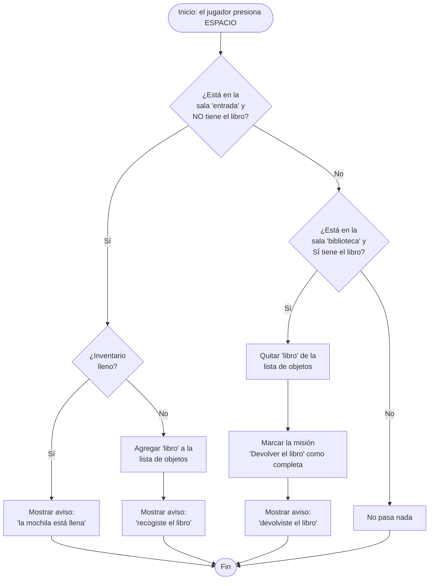

# Checkpoint 1 — Aventura Algorítmica: *9PM*

Equipo de 4 · Semanas 1 a 3 · 10% de la nota final

Este documento reúne los cuatro entregables del Checkpoint 1: el concepto del
juego, el diagrama de flujo con su pseudocódigo de una mecánica, el inventario
del jugador funcionando con listas, y la explicación del código con sus
fragmentos relevantes. El proyecto completo vive en la carpeta
[`9PM/`](..); este archivo está en `9PM/docs/CHECKPOINT1.md`.

---

## 1. Concepto del juego (Semana 1)

| Elemento | Descripción |
|---|---|
| **Mundo** | El campus de una universidad, de noche. Son las **20:15** y a las **21:00** empieza el toque de queda. El campus se modela como un grafo de salas conectadas por pasillos (entrada, patio central, biblioteca, cafetería, salones, laboratorio, auditorio, oficina del profesor y parqueadero). |
| **Protagonista** | Un/a estudiante que se quedó tarde resolviendo pendientes académicos y debe salir del campus antes de que empiece el toque de queda. Es la persona que el jugador controla y mueve por el mapa. |
| **Antagonista** | El **vigilante** nocturno del campus. Patrulla el campus siguiendo una ronda fija; si te ve *después* de las 21:00, te expulsa del campus por esa noche (game over). |
| **Objeto especial** | **El libro atrasado.** Hay que recogerlo en la entrada y devolverlo en la biblioteca antes de irte; es el objeto que primero se guarda y se usa desde el inventario. |
| **Problema a resolver** | Resolver tres pendientes — devolver el libro, imprimir un trabajo en el laboratorio y hablar con el profesor — y llegar al parqueadero antes de las 21:00, sin ser visto por el vigilante una vez empiece el toque de queda. |

Estos elementos ya están implementados: el grafo del campus en
[`mapa.py`](../mapa.py), el estado del reloj y el toque de queda en
[`estado_mundo.py`](../estado_mundo.py), y las tres misiones en
[`misiones.py`](../misiones.py).

---

## 2. Diagrama de flujo y pseudocódigo (Semana 2 / Guía 2)

Se documentan dos mecánicas del juego: **recoger / usar / soltar un objeto**
(la mecánica de inventario que pide este checkpoint) y **la detección del
vigilante** (la mecánica que genera la tensión y el "game over" del juego).

### 2.1 Mecánica: recoger, usar y soltar un objeto

Ocurre cada vez que el jugador presiona **ESPACIO** cerca de una sala.
Implementada en `Partida.interactuar()` dentro de [`main.py`](../main.py),
usando `Inventario.agregar()` y `Inventario.quitar()` de
[`inventario.py`](../inventario.py).



**Pseudocódigo:**

```
Algoritmo InteractuarConSala
    Definir sala_actual, inventario, mision_libro Como Objeto

    Si sala_actual = "entrada" Y NO mision_libro.completada Y NO inventario.tiene("libro") Entonces
        Si inventario.esta_lleno() Entonces
            Mostrar "La mochila está llena"
        SiNo
            inventario.agregar(objeto_libro)   // objeto_libro.append() a la lista
            Mostrar "Recogiste el libro que debes devolver a la biblioteca"
        FinSi

    SiNo Si sala_actual = "biblioteca" Y inventario.tiene("libro") Entonces
        inventario.quitar("libro")             // remove() de la lista
        mision_libro.completar()
        Mostrar "Devolviste el libro. Misión completa"

    FinSi
FinAlgoritmo
```

### 2.2 Mecánica: detección del vigilante

Se evalúa en cada cuadro del juego dentro de `Partida.actualizar()`
([`main.py`](../main.py)), usando el grafo y BFS/DFS de
[`mapa.py`](../mapa.py) para mover al vigilante y el diccionario de
[`estado_mundo.py`](../estado_mundo.py) para saber si el toque de queda ya
empezó.

```mermaid
flowchart TD
    A([Inicio: cada cuadro del juego]) --> B[Mover al vigilante un paso\nsobre su ruta BFS actual]
    B --> C{¿Terminó la ruta\nactual del vigilante?}
    C -- Sí --> D[Calcular nueva ruta con BFS\nhacia la siguiente sala de su\nronda DFS]
    D --> E
    C -- No --> E{¿Ya está activo\nel toque de queda?}
    E -- No --> Z([Fin del cuadro])
    E -- Sí --> F[Calcular distancia entre\njugador y vigilante]
    F --> G{¿distancia < RADIO_DETECCION\n_(75 px)_?}
    G -- Sí --> H[Fin de la partida:\n'Un vigilante te vio\ndespués del toque de queda']
    H --> Z
    G -- No --> Z
```

**Pseudocódigo:**

```
Algoritmo DetectarJugador
    Definir toque_queda_activo Como Lógico
    Definir pos_jugador, pos_vigilante Como Punto
    Definir RADIO_DETECCION Como Entero = 75

    vigilante.moverUnPaso()   // avanza por su ruta BFS; si la terminó, arma
                              // una nueva con BFS hacia la siguiente sala
                              // de su ronda (calculada con DFS al iniciar)

    Si toque_queda_activo Entonces
        distancia <- Distancia(pos_jugador, pos_vigilante)
        Si distancia < RADIO_DETECCION Entonces
            partida.terminar("Un vigilante te vio después del toque de queda")
        FinSi
    FinSi
FinAlgoritmo
```

---

## 3. Inventario funcional con listas (Semana 3)

El inventario del jugador es una lista de diccionarios (`self.objetos = []`),
implementada en [`inventario.py`](../inventario.py):

```python
class Inventario:
    def __init__(self, capacidad_maxima=6):
        self.objetos = []
        self.capacidad_maxima = capacidad_maxima

    def agregar(self, objeto):
        if len(self.objetos) >= self.capacidad_maxima:
            return False
        self.objetos.append(objeto)
        return True

    def quitar(self, nombre_objeto):
        for objeto in self.objetos:
            if objeto["nombre"] == nombre_objeto:
                self.objetos.remove(objeto)
                return objeto
        return None

    def tiene(self, nombre_objeto):
        return any(o["nombre"] == nombre_objeto for o in self.objetos)

    def esta_lleno(self):
        return len(self.objetos) >= self.capacidad_maxima
```

- **Agregar (recoger):** `agregar()` usa `list.append()` y respeta la
  `capacidad_maxima` (rechaza el objeto si la mochila ya está llena).
- **Usar:** `tiene()` recorre la lista para confirmar que el objeto está
  antes de dejar completar una misión (por ejemplo, entregar el libro solo si
  `inventario.tiene("libro")`).
- **Soltar:** `quitar()` recorre la lista y usa `list.remove()` para sacar el
  objeto por nombre, devolviéndolo para poder mostrar un aviso.

Dentro del juego, `main.py` conecta estas tres acciones a la interacción del
jugador (`Partida.interactuar`, líneas 252-258):

```python
if sala == "entrada" and not self.mision_libro.completada and not self.inventario.tiene("libro"):
    if self.inventario.agregar(crear_objeto("libro")):
        self._agregar_toast("Recogiste el libro que debes devolver a la biblioteca.")
elif sala == "biblioteca" and self.inventario.tiene("libro"):
    self.inventario.quitar("libro")
    self.mision_libro.completar()
    self._agregar_toast("Devolviste el libro. Misión completa.")
```

El panel visual del inventario (tecla `I`/`TAB`) está en
[`ui_inventario.py`](../ui_inventario.py), y la búsqueda de un objeto por
nombre (tecla `F`) usa la misma lista en
[`buscador.py`](../buscador.py).

### Evidencia de ejecución

[`demo_inventario.py`](../demo_inventario.py) ejercita `Inventario` de forma
independiente (sin abrir la ventana del juego), agregando objetos hasta
llenar la mochila, comprobando qué se tiene, soltando un objeto y volviendo a
agregar uno. Se ejecuta con:

```bash
cd 9PM
python demo_inventario.py
```

Salida real de la ejecución:

```
--- 1. Inventario vacio ---
Objetos: []

--- 2. Agregar objetos (recoger) ---
Agregar 'libro': OK
Agregar 'carne_estudiantil': OK
Agregar 'usb': OK
Objetos actuales: ['libro', 'carne_estudiantil', 'usb']

--- 3. Inventario lleno: intentar agregar un cuarto objeto ---
Agregar 'linterna' con inventario lleno: RECHAZADO
esta_lleno(): True

--- 4. Consultar si se tiene un objeto (usar) ---
tiene('libro'): True
tiene('linterna'): False

--- 5. Soltar (quitar) un objeto ---
Se solto: Libro atrasado
Objetos despues de soltar: ['carne_estudiantil', 'usb']

--- 6. Intentar soltar un objeto que ya no se tiene ---
Resultado: None

--- 7. Ahora hay espacio: agregar la linterna que antes fue rechazada ---
Agregar 'linterna': OK
Objetos finales: ['carne_estudiantil', 'usb', 'linterna']
```

Esto confirma que agregar, usar (consultar) y soltar objetos funciona sin
errores, incluyendo los dos casos límite: mochila llena y soltar un objeto
que ya no está. El inventario también funciona integrado dentro del juego:
correr `python main.py` y presionar `ESPACIO` en la entrada recoge el libro,
y `I`/`TAB` abre el panel visual para verlo en la mochila.

---

## 4. Organización del código (Guía 1)

El proyecto sigue un archivo por estructura de datos / tema, con `main.py`
como archivo central que arma la ventana, el bucle del juego y conecta todo
lo demás:

| Archivo | Estructura de datos | Uso |
|---|---|---|
| [`main.py`](../main.py) | — | Archivo central: ventana, bucle principal, estados del juego |
| [`inventario.py`](../inventario.py) | **Lista** (Semana 3) | Objetos que el jugador recoge, usa y suelta |
| [`ui_inventario.py`](../ui_inventario.py) | — | Panel visual del inventario y catálogo de objetos |
| [`estado_mundo.py`](../estado_mundo.py) | Diccionario | Hora actual, toque de queda, luces |
| [`mapa.py`](../mapa.py) | Grafo (BFS/DFS) | Campus y movimiento/detección del vigilante |
| [`misiones.py`](../misiones.py) | Árbol | Misión principal y sus tres sub-misiones |
| [`historial.py`](../historial.py) | Pila | Deshacer el último movimiento (`Z`) |
| [`eventos.py`](../eventos.py) | Cola | Avisos programados de la noche |
| [`mazmorra.py`](../mazmorra.py) | Recursión | Generación de pisos de un edificio |
| [`ranking.py`](../ranking.py) | Ordenamiento | Mejores puntajes de partidas |
| [`buscador.py`](../buscador.py) | Búsqueda | Buscar un objeto en el inventario por nombre |
| [`demo_inventario.py`](../demo_inventario.py) | — | Evidencia de ejecución del inventario (Checkpoint 1) |

Este checkpoint solo pide hasta la Semana 3 (concepto, diagrama/pseudocódigo
e inventario); los demás archivos ya están integrados y funcionando porque el
equipo avanzó el desarrollo del juego más allá del checkpoint actual, pero no
son parte de lo que se evalúa aquí.

---

## 5. Cómo correr el proyecto

```bash
cd 9PM
pip install -r requirements.txt
python main.py            # el juego completo
python demo_inventario.py # evidencia del inventario por consola
```

Ver [`README.md`](../README.md) para los controles completos del juego.
